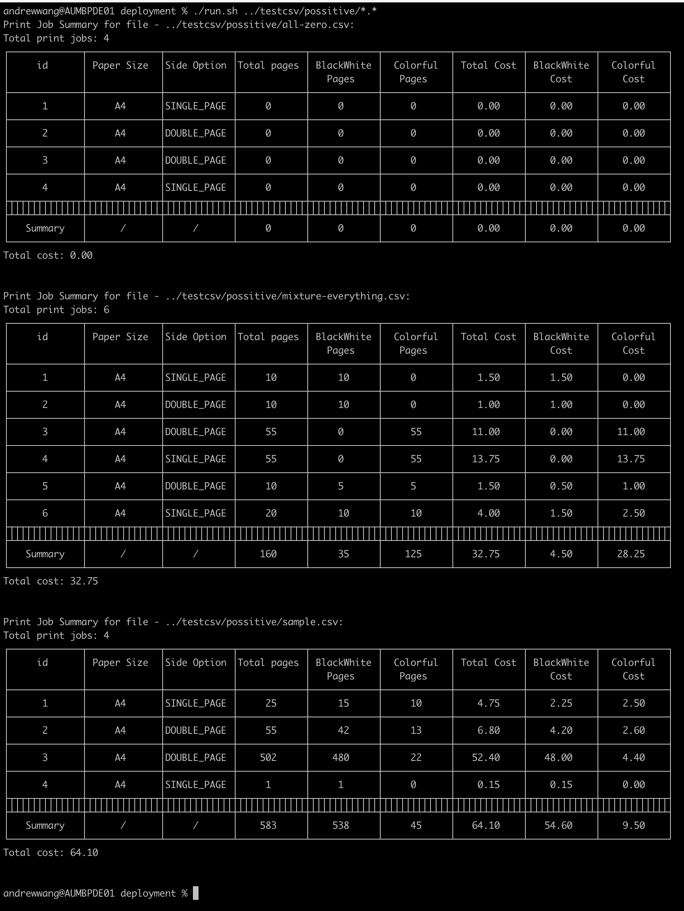
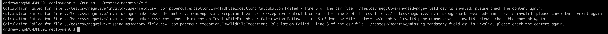

# PaperCut Code Challenge: Printing Job Cost Calculator

# Overview

To reduce printing waste, a school is implementing PaperCut and will charge for printing as follows:

Paper size A4, job type single-sided:

* 15 cents per black and white page
* 25 cents per colour page

Paper size A4, job type double-sided:

* 10 cents per black and white page
* 20 cents per colour page

Write a program in Java (or if we have discussed it during our phone conversation - another programming language you feel more comfortable
with) that helps the system administrator calculate the print costs.

The application should:

* Read print job details - total number pages, number colour pages, and whether job is double-sided - from a file (see attached file for an
  example)
* Output the details of each print job and calculated cost to the console
* Output the total cost of all jobs to the console
* Show how you have tested your application

Support for other paper sizes will be added in the future.

# Assumption:

* The smallest unit for the amount is 2 digit. (For instance, for AUD, 50 cent is 0.5 AUD. While the smallest unit for Japanese Yen is 3
  digit. We will just ignore it for now.)
    * By default, the csv filie contains the header. But this can be configured by set `csv.contains.header` to `true` or `false`
* Each row of the file contains 3 and only 3 column: Total Pages, Colour Pages and Double Sided. All 3 fields are mandatory, if any field is
  not provided or is incorrect, the calculation will terminate with error message accordingly.
    * Total Pages: numeric value from 0 to max limit(configured in application.properties "total.pages.max", default is 10000);
    * Colour Pages: numeric value from 0 to the total page number;
    * Double Sided: casse is ignored and value could be "true" or "false"

# Configuration

Application is configurable by using the application.properties file. Currently, some supported configs and default values are as followed:

* the maximum/minimum pages allowed for each print task(defined in each row of the csv file)
    * total.pages.max=10000
    * total.pages.min=0
    * color.pages.max=10000
    * color.pages.min=0
* CSV file configuration
    * csv.contains.header=true - is the first row of the CSV file the header?
    * csv.max.size.mb=50 - the maximum file size allowed for processing
* Print configuration
    * allowed.paper.size=a4 - the list of allowed file size separated by `,`. Currently only `a4` is allowed
* Price configuration
    * a4.singlepage.blackwhite.cent=15
    * a4.singlepage.colour.cent=25
    * a4.doublepage.blackwhite.cent=10
    * a4.doublepage.colour.cent=20

# Build And Run

This project requires `Maven 3.6` and `Java 8` to build and run. Please follow the following steps to get this project running:

1. Clone this repository
   ```
   git clone https://github.com/1fan/papercut-printing-cost-calculator.git
   ```
2. Go to the local directory and execute `clean-and-build.sh`.  
   This step will do a `mvn clean install` and move the jar file and related files(config files, run.sh, etc) into a new
   folder `./deployment`

    ```
    $ cd papercut-printing-cost-calculator
    $ ./clean-and-build.sh
    ```
   After this step, you should be able to see a new 'deployment' folder with the following structure:
    ```
    .
    ..
    +-- printing-cost-calculator-1.0-SNAPSHOT.jar
    +-- run.sh
    +-- config
    |   +-- application.properties
    |   +-- log4j2.xml
    ```   

3. Go to the `./deployment` folder.\
   You can change the configuration if needed. By default, configuration file and log4j2.xml files are both put in `./config` folder, you can
   replace the value as per requirements.

4. Run the application
   ```
   ./run.sh $filepath1 $filepath2 $filepathn
   ```
   Just append one or more filepath as commandline arguments to run the application. For instance,
   ```
   ./run.sh sample.csv sample2.csv
   ```
   if sample.csv and sample2.csv are both in the same folder.

   You can also apply different JVM options by updating the run.sh script as per your requirements.

   If the run.sh doesn't have the "x"
   permission to execute, run the following script to grant it execution permission.
   ```
   chmod +x run.sh
   ```

   Or can just open the project in IDE and start it.

# Calculation Function Demo

* Happy Scenarios
  

* Negative Scenarios
  

# Future Enhancement and Integration

* Can consider integrating this cost calculation project into a scheduling job(probably via a shell cron job or Spring scheduler) to run
  calculation on a specific target destination as a batch job;
* Can consider exporting the calculation result to a format that is easily stored or shared. For instance, We can consider storing the
  calculation result to S3 for historic tracing purpose, or export to a form that can be shared via email to end users.